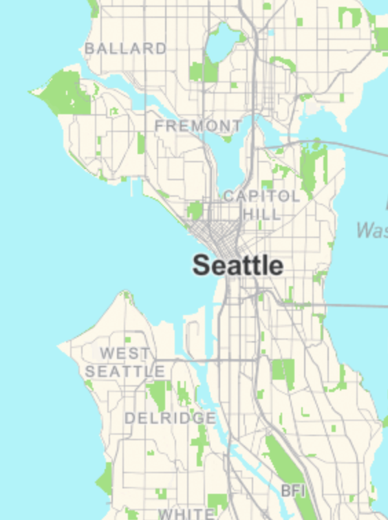
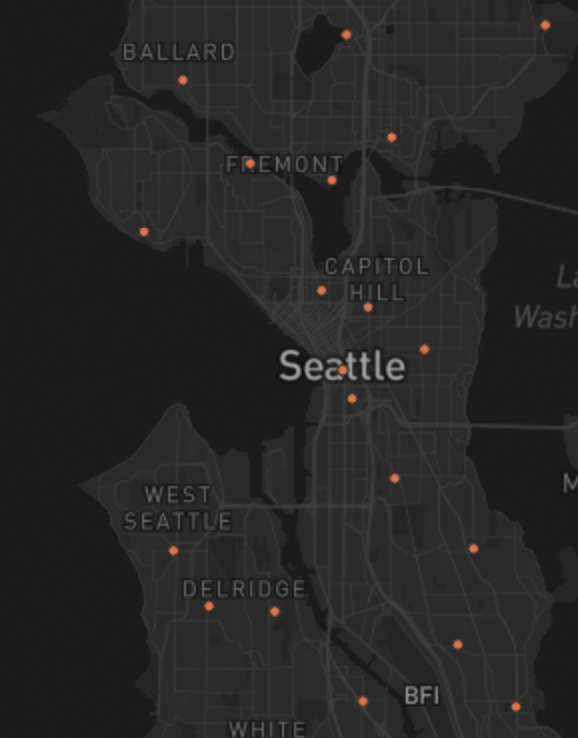
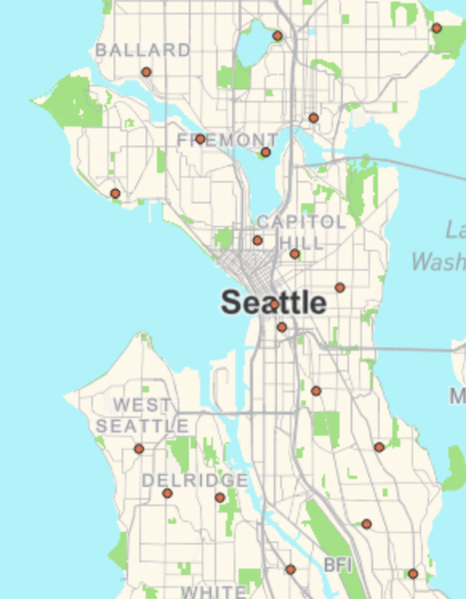
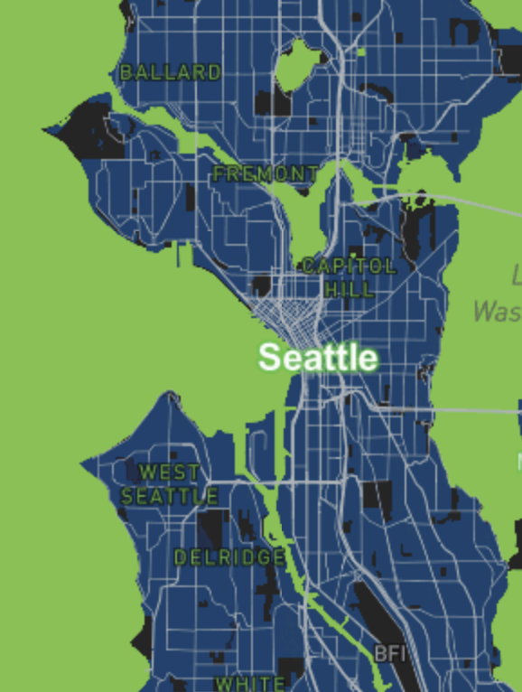

# Map Design and Tile Generation
For this project, I created a map to showcase four different tile sets represented within Seattle and its surrounding areas at a minimum zoom level of 1 and a maximum zoom level of 12. These visualizations help to put into perspective how different themes can be implemented to produce different information even if it's in the same place.

## Implementation
### 1. Custom Base Map
For the custom base map, I decided to choose colors that would mirror those that you will usually see in other maps and that would also accurately represent the type of landscape you are looking at. Doing this not only gave me some practice in Mapbox studio and modifying the base monochrome but it also helped to set a good base map that I could build upon as I worked through this project.

    

### 2. Voting Ballot Dropboxes
For the second thematic layer, I choose to represent geospatial data that indicates where each voting ballot dropbox is located in Seattle and the surrounding areas. I wanted to represent this data because I believe that this is a relevant topic considering that we have a presidential election coming up soon in the U.S. and thus having this kind of information can be useful once that time comes.

    

### 3. Base Map & Ballot Dropboxes
For this third layer, I combined both my base map and the ballot dropboxes geospatial data to create a map that would help me showcase both pieces of information in a way that was easy to understand. Doing so also gave me more practice in the different ways we can represent geospatial data in certain areas.

    

### 4. Seahawks Theme Map
For my last map, I choose to go get more creative and showcase the area with a Seattle Seahawks theme. Creating this layer was a fun way to work with the different tools and customization options available on Mapbox studio.

    

## Map Link
